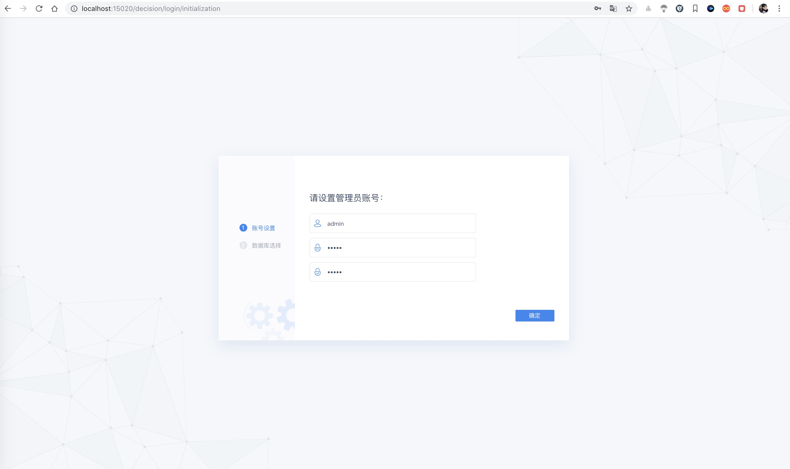
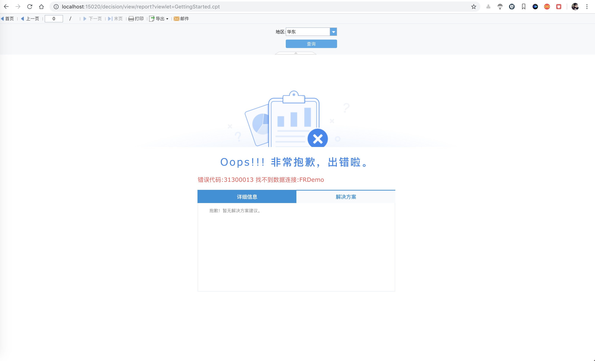

# fine-report-10

> 帆软报表10.0，基于spring boot。那些所谓集成spring boot的教程，最后打包成war，要脸吗？

[9.0集成](github.com/xuanbo/fine-report)

## 安装依赖

由于帆软只给了`jar`包，我们需要通过`maven`安装到本地仓库。

注意：

* 10.0需要将`jdk/lib/tools.jar`放入`classpath`，因此自己替换`lib`目录下的jar。
* fine-third-10.0.jar这个包太了，spring-boot不支持，会报错（https://github.com/spring-projects/spring-boot/issues/2895#）
因此只能将其拆分为2个jar，即fine-third-v2-10.0.jar。

由于jar太大了，一直上传失败，因此，请手动到帆软官网下载吧。最后别忘了拆分fine-third-10.0.jar，否则太大了。

### Windows

对于`Windows`用户，运行`install/installjars.bat`。

### Unix

对于`Linux`、`Mac os`用户，运行`install/installjars.sh`。

## 配置

### 系统

#### 端口

默认15020。配置文件`src/main/resources/application.yml`。

#### 日志

日志默认（异步）输出到`logs`目录下，配置文件`src/main/resources/logback-spring.xml`。

默认日志级别`INFO`，文件格式`finereport.yyyy-MM-dd.log`

### 帆软

看下官方文档对目录的说明，将资源copy到`env`目录下，为了保证项目大小，并未完全添加资源。

#### CPT模板

需要将cpt上传到`env/WEB-INF/reportlets`下。

## 部署

### 打包

```shell
$ mvn clean
$ mvn package
```

### 运行

注意：**需要将`env`目录与打包好的`jar`放在同一个目录下**，程序启动后会将`env`目录作为`docBase`。

```shell
$ nohup java -jar fine-report.{version}.jar > startup.log &
```

### 访问

* 浏览器访问：`http://127.0.0.1:15020`
* 帆软地址：`http://127.0.0.1:15020/decision`。



* 访问帆软模板：`http://localhost:15020/decision/view/report?viewlet=GettingStarted.cpt`，其中`GettingStarted.cpt`需要在`env/WEB-INF/reportlets`下存在。



## 问题

### 为什么要重置`src/main/webapp`目录到`env`？

这是因为创建`src/main/webapp`目录后，如果将帆软资源复制进去后，那么在打包的时候，则需要打成`war`包（通过`tomcat`部署）。

而重置`webapp`目录到`env`后，可以打包成`jar`包，帆软此时通过`env`目录来进行配置读取、模版解析、备份等。

也就是说，`env`目录相当于`tomcat`的`docBase`了。